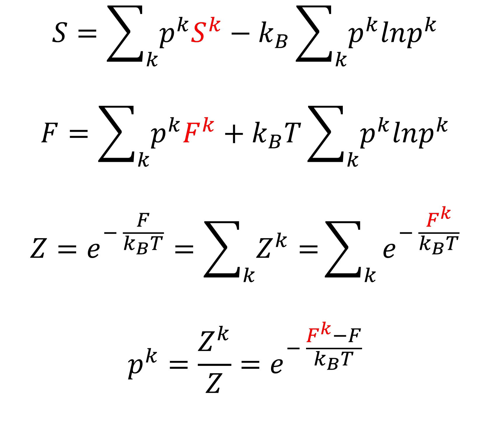

# PyZentropy

## Overview
PyZentropy is a Python package designed to implement the zentropy approach, enabling the calculation of the total entropy of a system by combining the entropy contributions from individual configurations.

## What does PyZentropy do?

    

## Installation

## Documentation
The following papers give an overview of zentropy:

Liu, ZK., Wang, Y. & Shang, SL. Zentropy Theory for Positive and Negative Thermal Expansion. J. Phase Equilib. Diffus. 43, 598–605 (2022). https://doi.org/10.1007/s11669-022-00942-z

Zi-Kui Liu 2024 J. Phys.: Condens. Matter 36 343003. https://doi.org/10.1088/1361-648X/ad4762 

## Citing PyZentropy
